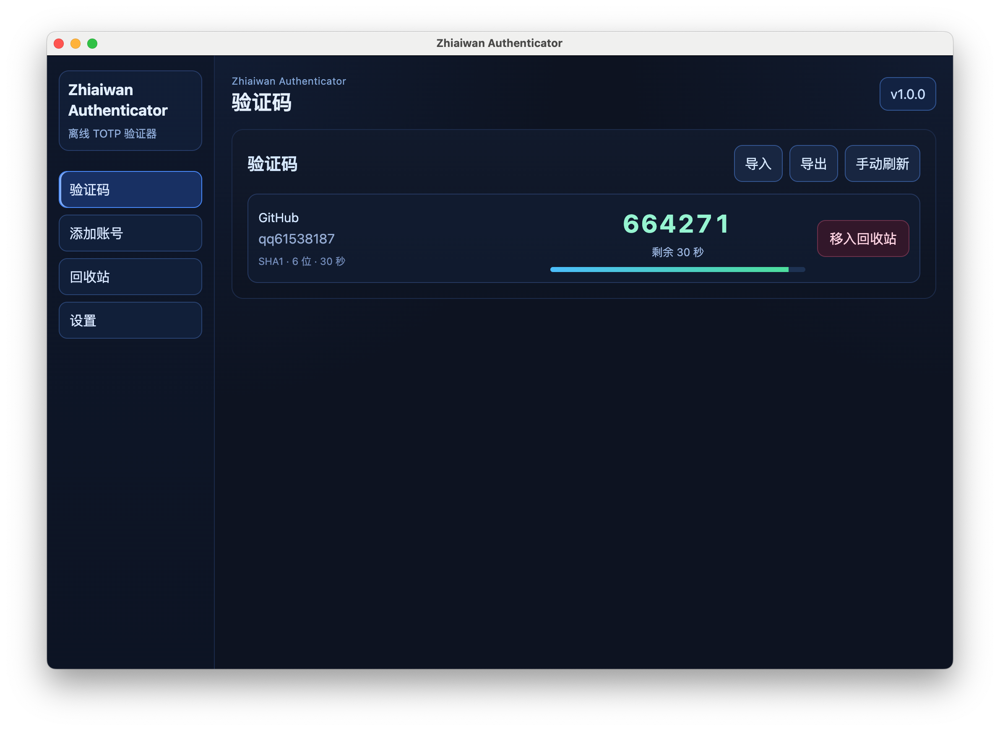
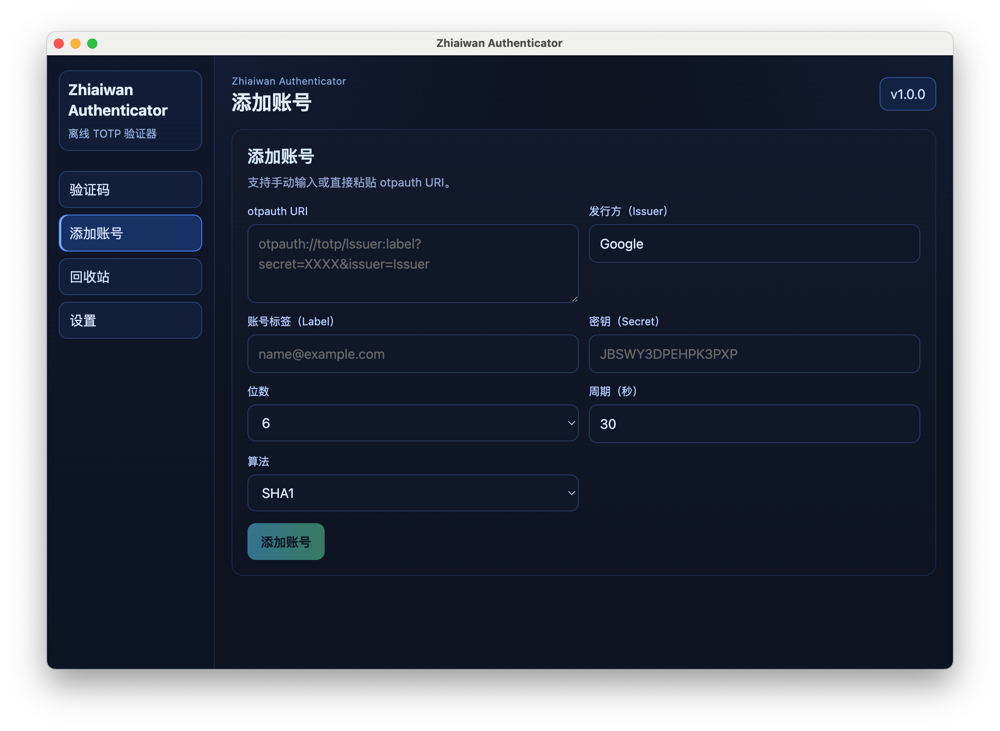
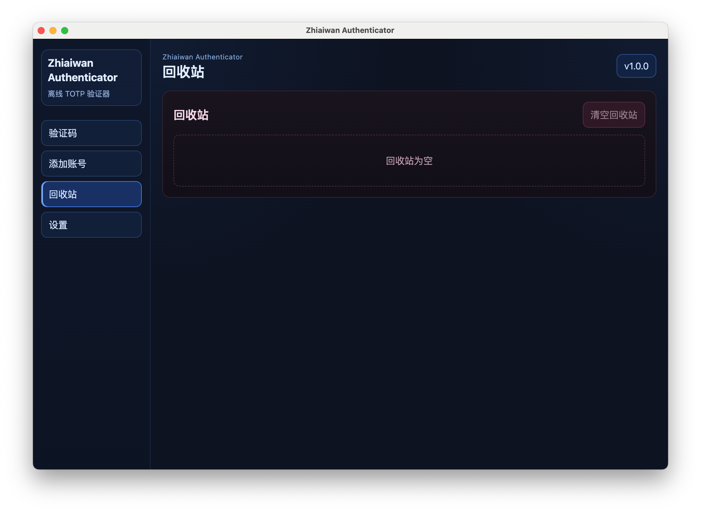

# Zhiaiwan Electron Authenticator

`Zhiaiwan Electron Authenticator` 是一个基于 `Electron + Vue 3 + TypeScript` 的桌面双因素验证码（TOTP）应用，支持本地离线使用、跨平台构建与发布流程自动化。

## 功能点

- **验证码管理**
  - 支持新增 TOTP 账号（issuer / label / secret / 算法 / 位数 / 周期）
  - 实时刷新验证码与剩余秒数
  - 支持账号导入 / 导出
- **回收站能力**
  - 删除账号进入回收站，可恢复或彻底删除
  - 记录删除时间并按时间排序
  - 支持清空回收站（可要求主密码验证）
- **安全能力**
  - 支持设置 / 更新主密码（`scrypt + salt`）
  - 应用启动锁屏（启用主密码时）
  - 多次失败触发冷却时间
  - 主进程会对关键 `auth:*` IPC 做解锁状态校验
- **系统集成**
  - 托盘显示与隐藏
  - 开机启动开关
  - 全局唤起快捷键（Option + Space）
  - 悬浮球（开关、透明度、文本、背景图、背景色，支持确认后保存）
- **国际化与体验**
  - 中文 / 英文双语
  - 设置页、锁屏页、危险操作区已做分层与交互优化

## 技术栈

- **前端**
  - `Vue 3`（Composition API）
  - `TypeScript`
  - `Vite`
- **桌面端**
  - `Electron`（`main/preload/renderer` 分层）
  - IPC 通信（`contextBridge + ipcMain/ipcRenderer`）
- **验证码与安全**
  - `otplib`（TOTP）
  - Node.js `crypto`（主密码哈希与盐值处理）
- **工程化**
  - `ESLint + Prettier`
  - `Husky + lint-staged`
  - `commitlint + commitizen(cz-git)`
  - `changeset`
  - `GitHub Actions`

## 应用截图

### 验证码主页



### 设置页面



### 其他页面示例



## 目录结构

```text
zhiaiwan-electron-authenticator/
├─ electron/                      # 主进程与 preload
│  ├─ main.cjs                    # Electron 主进程、IPC、存储与安全逻辑
│  ├─ preload.cjs                 # 暴露给渲染进程的安全 API
│  └─ project-meta.cjs            # 项目元信息（仓库地址/应用名等）
├─ src/
│  ├─ components/
│  │  ├─ authenticator/           # 验证码页、新增账号页、回收站页
│  │  ├─ settings/                # 设置面板
│  │  └─ security/                # 锁屏组件
│  ├─ composables/
│  │  ├─ useAuthenticator.ts      # 账号/验证码/回收站状态与操作
│  │  ├─ useAppSettings.ts        # 应用设置状态与操作
│  │  └─ useI18n.ts               # 国际化能力
│  ├─ i18n/                       # 中英文文案
│  ├─ types/                      # 类型定义
│  ├─ App.vue                     # 应用壳层与页面编排
│  └─ main.ts                     # 渲染进程入口
├─ .github/workflows/             # CI、changeset、release 等工作流
├─ .changeset/                    # changeset 版本变更记录
├─ docs/
│  └─ release-workflow.md         # 发布流程说明（中文）
├─ package.json
└─ CONTRIBUTING.md                # 贡献与提交流程说明（中文）
```

## 常用命令

```bash
# 本地开发
npm install
npm run dev

# 质量检查
npm run lint
npm run build
npm run format:check

# 提交与版本
npm run commit
npm run changeset
```

## 构建产物

- macOS:
  - `npm run dist:mac:intel`
  - `npm run dist:mac:apple`
  - `npm run dist:mac:both`
- Windows:
  - `npm run dist:win`

> `release/` 为构建产物目录，已在 `.gitignore` 中忽略，不会提交到仓库。
